# [Growing Guide](https://runwiththerhythm.github.io/growing-guide)

Growing Guide is a beginner friendly, informative and interactive gardening app. This app was created with beginner gardeners and seasonal growers in mind. I sought to create a calm, helpful space where you could quickly see what to plant and when, without the overwhelm of too much information.

You can explore the growing guide in two ways: by individual plants or by month, helping you plan ahead or just stay in sync with the season.

The design is kept simple, fun, friendly and yet informative.

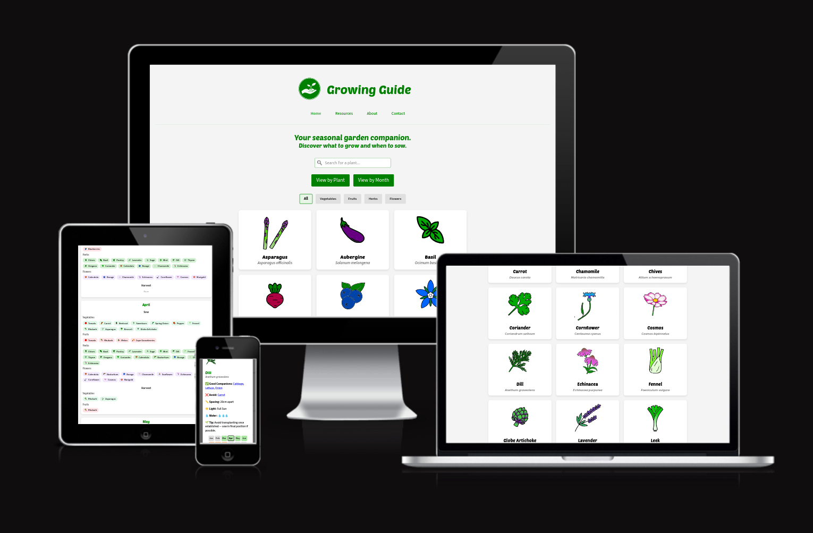

Source: [growing-guide amiresponsive](https://ui.dev/amiresponsive?url=https://runwiththerhythm.github.io/growing-guide)

## Live Project
### [View the live project here.](https://runwiththerhythm.github.io/growing-guide)

## The 5 Planes of UX

### 1. Strategy Plane
#### Purpose
- Help users plan their gardening activities with a simple, accessible interface.
- Offer seasonal sowing and growing guidance tailored to the UK climate.
- Promote learning through detailed plant info and curated resources.

#### Primary User Needs
- Know what to sow and when and be able to navigate this information quickly.
- Filter plants by type.
- Search for plants quickly.
- Access reliable growing info and learning resources.
- Use the app easily across devices, including mobile.

#### Business Goals
- Build a visually engaging, educational tool to support home gardening.
- Showcase potential for portfolio use or expansion into a more feature-rich tool.

### 2. Scope Plane
#### Features
- A full list of [Features](#features-1) can be viewed in detail below.

#### Content Requirements
- Icons for plants.
- Plant data: name, type, sowing months, harvest months, companions, plants to avoid.
- Navigation accessibility for all screen sizes.
- Resource links and categories.

### 3. Structure Plane
#### Information Architecture
- **Navigation Menu**:
  - Simple navbar with accessible links.
- **Hierarchy**:
  - Logo and branding at the top of the page.
  - Navbar centrally underneath.
  - Filter controls and views are prominent.
  - Plants / months shown in a grid with interaction cues.

#### User Flow
1. User lands on the home page → reads intro and sees default plant view.
2. Directly searches for a plant or filters or switches views → explores seasonal plants.
3. Clicks a plant → reads modal with growing instructions and tips.
4. Clicks through the plant names in modal → taken to the clicked plants modal.
4. Uses navigation to explore Resources or learn more about the app.
5. Return to explore more plants.

### 4. Skeleton Plane
#### Wireframe Suggestions
- A full list of [Wireframes](#wireframes) can be viewed in detail below.

### 5. Surface Plane
#### Visual Design Elements
- #### Colour Scheme

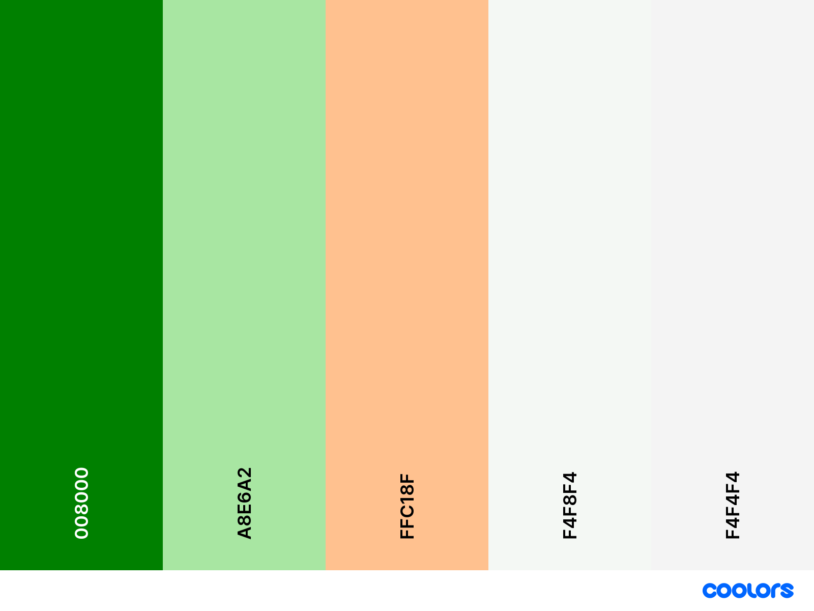
#### Typography

- [Poetsen One](https://fonts.google.com/specimen/Poetsen+One) was used for the primary headings and titles.
Poetsen One is a bold, rounded display typeface inspired by hand-painted signage and classical Roman letterforms. Its playful and friendly character makes it ideal for headlines, logos, and branding that aim to convey warmth and approachability.

- [Source Sans 3 ](https://fonts.google.com/specimen/Source+Sans+3) was used for all other secondary text. Source Sans 3 provides a clean professional and light sans-serif to compliment the heavier Poetson One and it looks good and legible when it italics for the scientific plant names.

### User Stories

| Target | Expectation | Outcome |
| --- | --- | --- |
| As a first-time visitor | I want to immediately understand what the app does from the homepage | so that I know it’s useful for planning my garden. |
| As a first-time visitor | I want to quickly access beginner-friendly resources | so that I can learn how to start growing my own food.|
| As a first-time visitor | I want to browse the plant list without creating an account  | so that I can explore without commitment. |
| As a first-time visitor | I want to see plant info in a modal with clear, attractive images and symbols  | so that I can quickly understand their needs. |
| As a first-time visitor | I would like to see a 404 error page if I visit a dead link | so I am not confused or lost. |
| As a returning visitor |  I want to jump straight into the calendar view | so that I can see what I need to do this month in my garden.|
| As a returning visitor | I want a Resources page with helpful links to articles, seeds and equipment retailers, and book recommendations  | so I can keep learning about growing. |
| As a returning visitor | I want to be able to search for specific plants  | so I can find information I need efficiently. |
| As a returning visitor | I want to be able to contact the app creator  | so I can give them feedback. |
| As a mobile user |  I want a fully responsive app with buttons and text large and readable | so I can use the app outside in the garden. |

## Wireframes

To follow best practice, wireframes were developed for mobile, tablet, and desktop sizes.
I've used [Canva](https://www.canva.com) to design my site wireframes.

| Page | Mobile | Tablet | Desktop |
| --- | --- | --- | --- |
| Home | 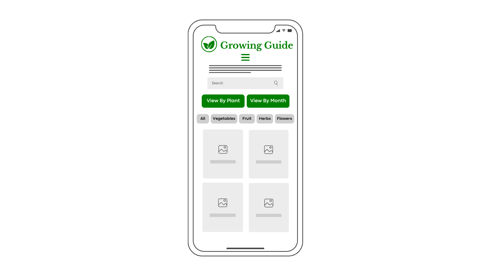 | 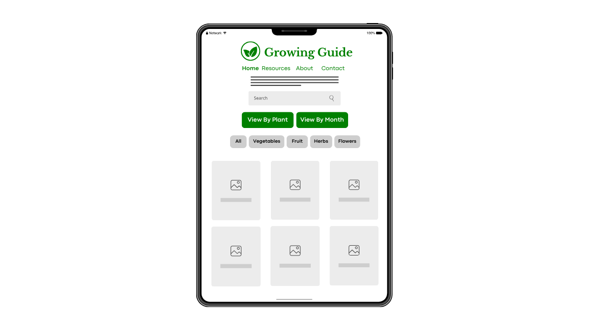 | 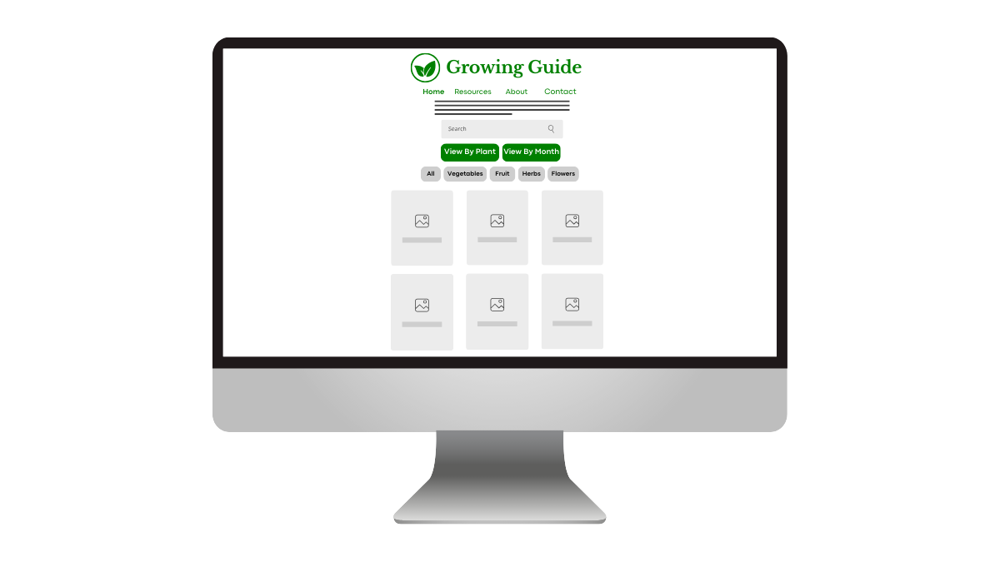 |

## Features

### Existing Features

| Feature | Notes | Screenshot |
| --- | --- | --- |
| Navigation | Found on all pages, the fully responsive navigation area features a clear logo an app name which are clickable to take the user to the main page. The navigation links are and simple and light so as not to detract from the main app experience. On mobile the nav is accessed through a hamburger icon. |  |
| Search | The search form allows the user to search for plants and categories and uses js to update in real time. | 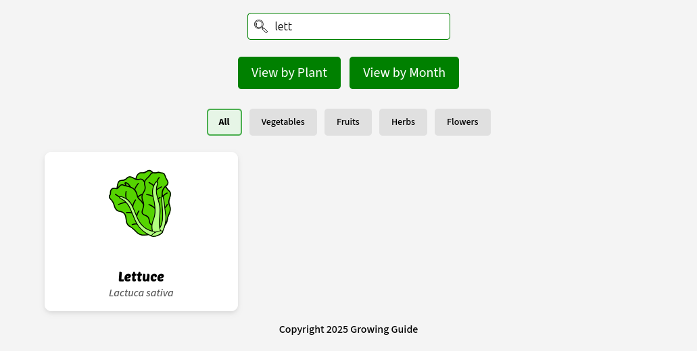 |
| Plant View | This is the default view of the app which displays all plant cards in a grid and allows the user to click on them to view the interactive modal. | 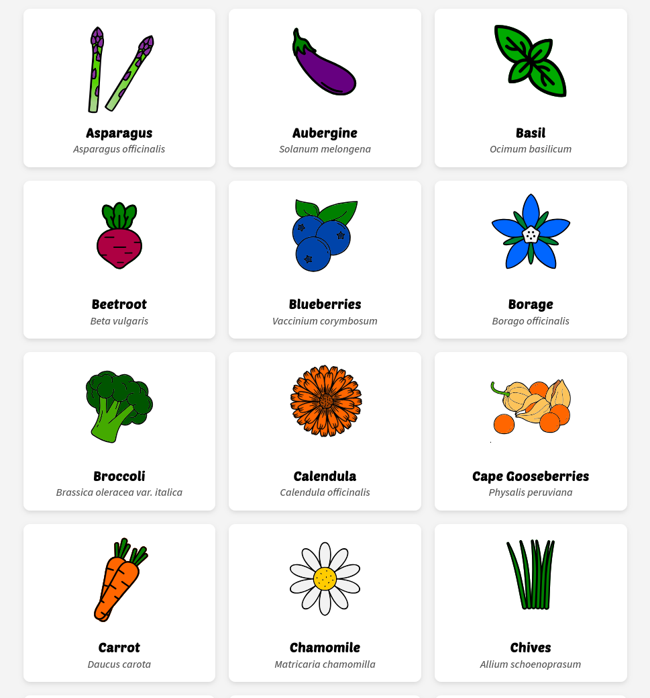 |
| Month View | Accessed from the CTA button this view displays months as cards in a responsive grid with sowing and harvesting info displayed per plant with a pastel coloured pill design. | 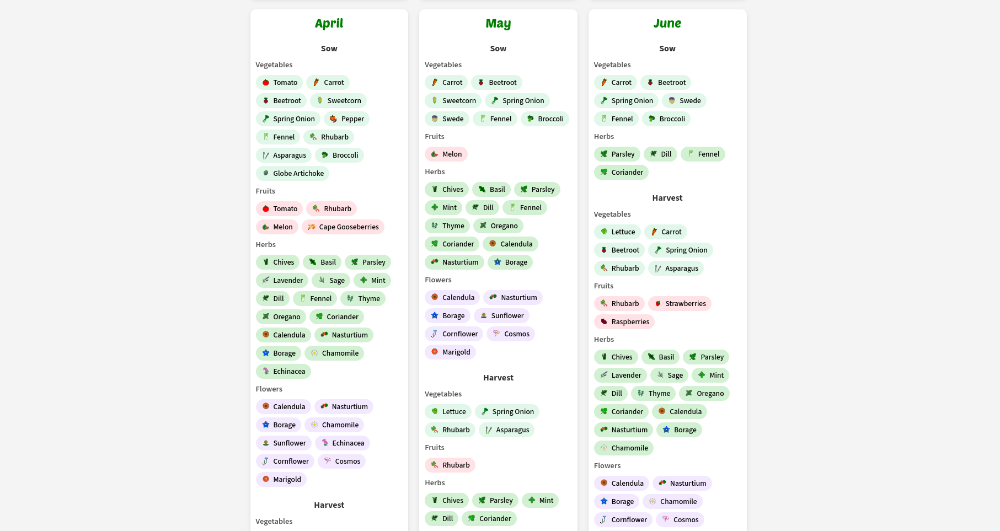 |
| Type Filters| Buttons that allow the user to filter the displayed plants by type of vegetables, fruit, flower or herbs. | 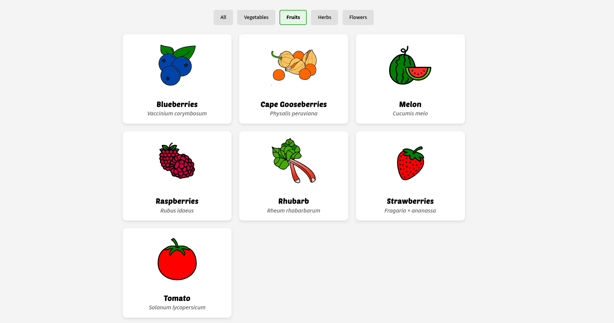 |
| Plant Modal| Accessed when the user clicks on any plant name this is where the plant data is displayed. Featuring a calender strip to show sowing and harvesting times and simple but informative plant info. | 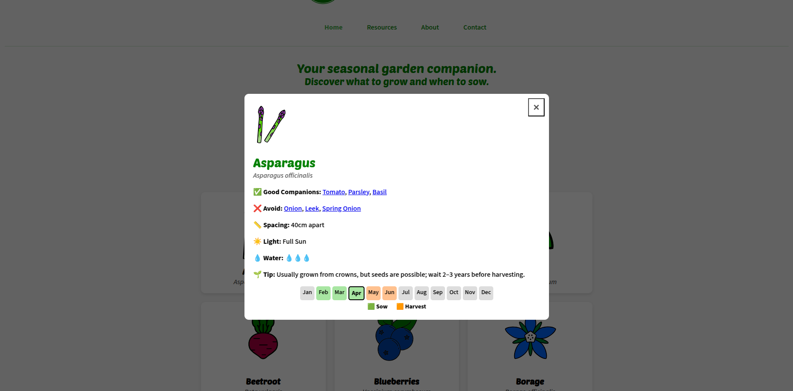 |
| Resources Page | A handy and educational list of helpful resources including education and shopping. | 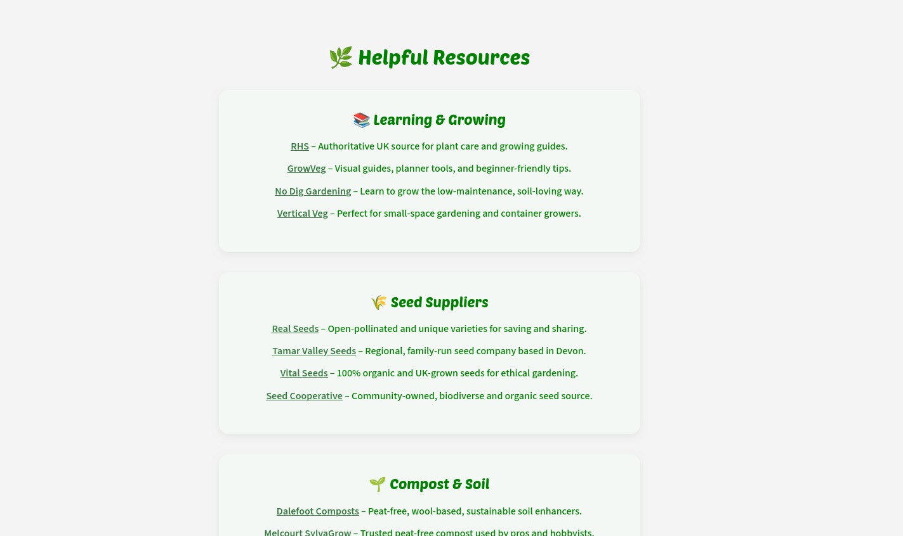 |
| Contact Page| This contact form gives the impression it allows the user to contact the app creator with feedback. It submits to a success page to provide feedback to the user. | 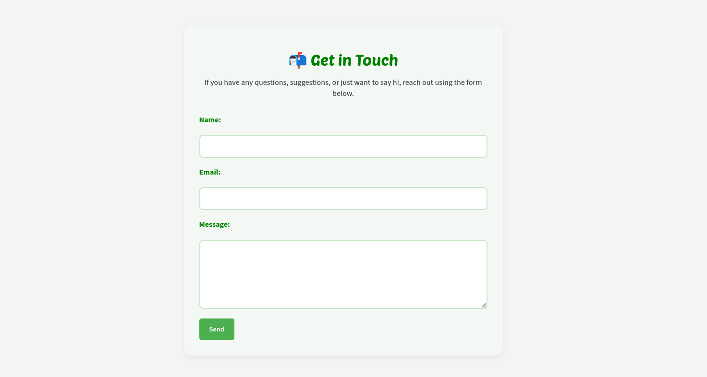 |
| 404 | The 404 error page will indicate when a user has somehow navigated to a page that doesn't exist. This replaces the default GitHub Pages 404 page, and ties-in with the look and feel of the site by using the standard navbar. | 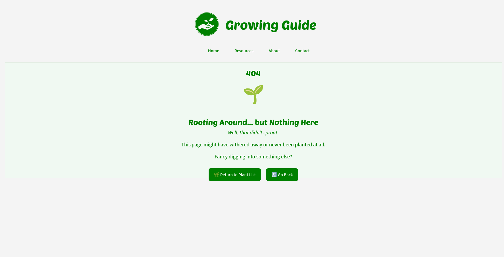 |

### Future Features

- **Sow and harvest for the same month**: Currently the app only shows sow or harvest for each month, several species can be sown and harvested at the same month however so this is a priority future feature.
- **Include 'planting out' and 'indoor / outdoor sowing**: Adding more detailed information to include more growing conditions.
- **User Favourites**: Allow users to add a list of favourite plants for quick access and planning.
- **Expand resource listings**: Add more links and content to the resources page.
- **Add more plants to the data**: Add more plants to the data starting with ones which are referenced as companions or avoid.
- **Dark Mode and toggle**: Implement dark mode with toggle switch to switch between light mode and dark mode.
- **UI/UX enhancements**: Add more soft animations and transitions between views.
- **Attach email to contact form**: Set up the contact form so it actually submits to an email address.

## Tools & Technologies

| Tool / Tech | Use |
| --- | --- |
|  | Generate README and TESTING templates. |
|  | Version control. (`git add`, `git commit`, `git push`) |
|  | Secure online code storage. |
|  | Local IDE for development. |
|  | Main site content and layout. |
|  | Design and layout. |
|  | User interaction on the site. |
|  | Hosting the deployed front-end site. |
|  | Automated JavaScript testing. |
|  | Help debug, troubleshoot, and explain things. |

## Agile Development Process

### GitHub Projects

[GitHub Projects](https://www.github.com/runwiththerhythm/growing-guide/projects) served as an Agile tool for this project. Through it User Stories, issues/bugs, and features were planned, then tracked using the project board.

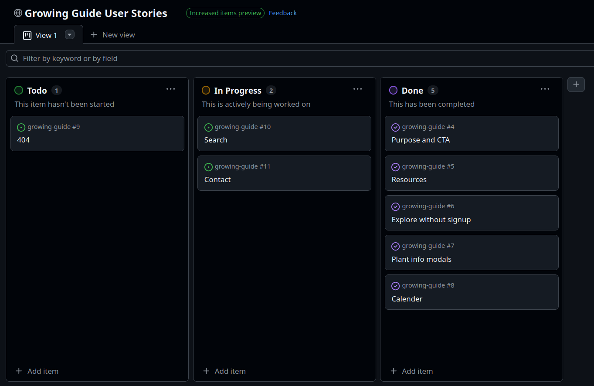

### GitHub Issues

[GitHub Issues](https://www.github.com/runwiththerhythm/growing-guide/issues) served as an another Agile tool. There, I managed my User Stories, feature implementation and tracked any issues/bugs.

 

## Testing

> [!NOTE]
> For all testing, please refer to the [TESTING.md](TESTING.md) file.

## Deployment

### GitHub Pages

The site was deployed to GitHub Pages. The steps to deploy are as follows:

- In the [GitHub repository](https://www.github.com/runwiththerhythm/growing-guide), navigate to the "Settings" tab.
- In Settings, click on the "Pages" link from the menu on the left.
- From the "Build and deployment" section, click the drop-down called "Branch", and select the **main** branch, then click "Save".
- The page will be automatically refreshed with a detailed message display to indicate the successful deployment.
- Allow up to 5 minutes for the site to fully deploy.

The live link can be found on [GitHub Pages](https://runwiththerhythm.github.io/growing-guide).

### Local Development

This project can be cloned or forked in order to make a local copy on your own system.

#### Cloning

You can clone the repository by following these steps:

1. Go to the [GitHub repository](https://www.github.com/runwiththerhythm/growing-guide).
2. Locate and click on the green "Code" button at the very top, above the commits and files.
3. Select whether you prefer to clone using "HTTPS", "SSH", or "GitHub CLI", and click the "copy" button to copy the URL to your clipboard.
4. Open "Git Bash" or "Terminal".
5. Change the current working directory to the location where you want the cloned directory.
6. In your IDE Terminal, type the following command to clone the repository:
	- `git clone https://www.github.com/runwiththerhythm/growing-guide.git`
7. Press "Enter" to create your local clone.

#### Forking

By forking the GitHub Repository, you make a copy of the original repository on our GitHub account to view and/or make changes without affecting the original owner's repository. You can fork this repository by using the following steps:

1. Log in to GitHub and locate the [GitHub Repository](https://www.github.com/runwiththerhythm/growing-guide).
2. At the top of the Repository, just below the "Settings" button on the menu, locate and click the "Fork" Button.
3. Once clicked, you should now have a copy of the original repository in your own GitHub account!

### Local VS Deployment

There are no remaining major differences between the local version when compared to the deployed version online.

## Credits

### Content

| Source | Notes |
| --- | --- |
| [Royal Horticultural Society](https://www.rhs.org.uk/) | Plant information and inspiration |
| [Real Seeds](https://www.realseeds.co.uk/) | Accurate data for seasonal growing |
| [Markdown Builder](https://markdown.2bn.dev) | Help generating Markdown files |
| [Interactive Frontend Development](https://codeinstitute.net) | Code Institute walkthrough project inspiration |
| [JavaScript30](https://javascript30.com) | Additional JS help |
| [ChatGPT](https://chatgpt.com) | Help with code logic and explanations |

### Media

- Images
  - SVG line icons were used from the below sites and coloured in Inkscape vector software.
    - [Noun Project](https://thenounproject.com/)
    - [Vecteezy](https://www.vecteezy.com/free-vector/vector)

### Acknowledgements

- I would like to thank;
The [Code Institute](https://codeinstitute.net) for their learning materials and project assignment.
My Code Institute mentor, [Tim Nelson](https://www.github.com/TravelTimN) and my Nescot college facilitator Johnathan Jacobson for their support throughout development of this project.

