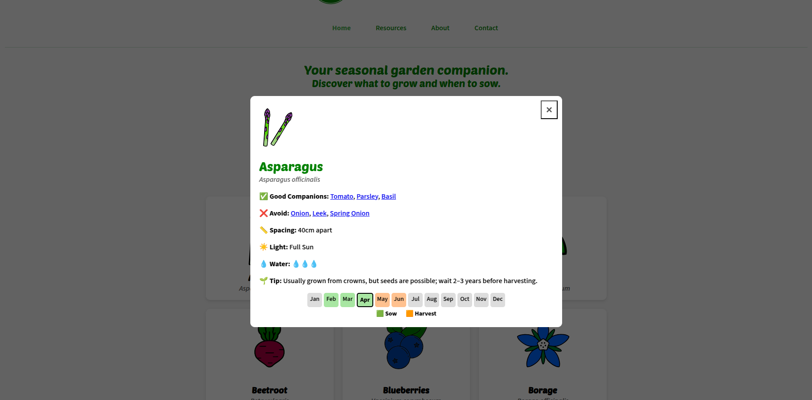
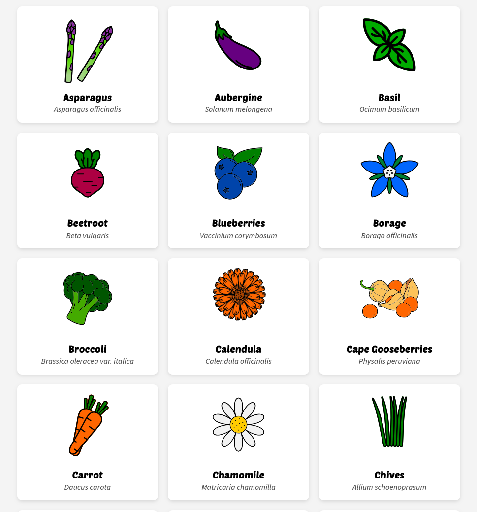
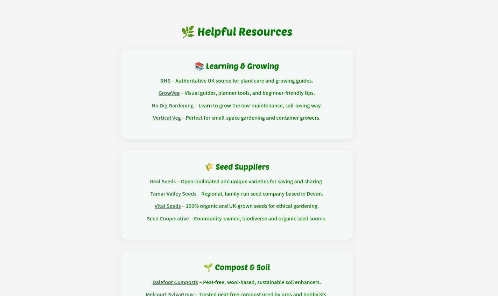
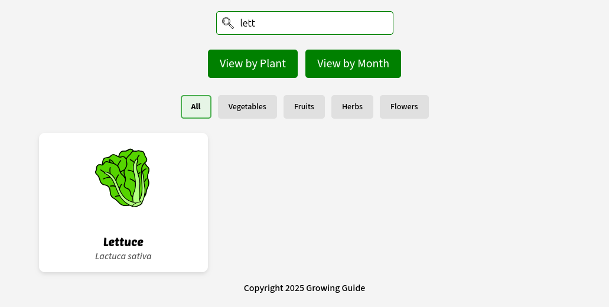
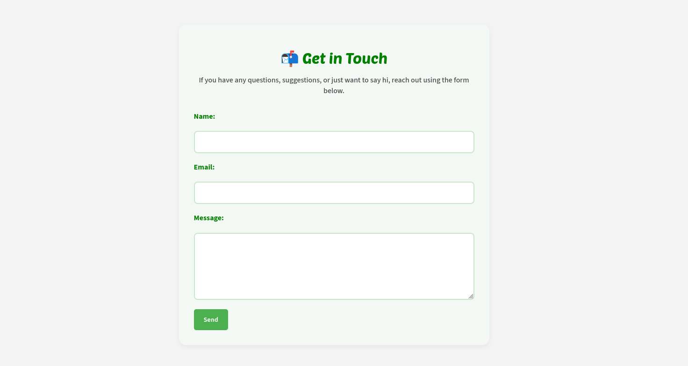

# Testing

> [!NOTE]
> Return back to the [README.md](README.md) file.

## Code Validation

### HTML

I have used the recommended [HTML W3C Validator](https://validator.w3.org) to validate all of my HTML files.

| Directory | File | URL | Screenshot | Notes |
| --- | --- | --- | --- | --- |
|  | [404.html](https://github.com/runwiththerhythm/growing-guide/blob/main/404.html) | [HTML Validator](https://validator.w3.org/nu/?doc=https://runwiththerhythm.github.io/growing-guide/404.html) |  |  |
|  | [index.html](https://github.com/runwiththerhythm/growing-guide/blob/main/index.html) | [HTML Validator](https://validator.w3.org/nu/?doc=https://runwiththerhythm.github.io/growing-guide/index.html) |  |  Fixed error |
|  | [resources.html](https://github.com/runwiththerhythm/growing-guide/blob/main/resources.html) | [HTML Validator](https://validator.w3.org/nu/?doc=https://runwiththerhythm.github.io/growing-guide/resources.html) |  |  |
|  | [about.html](https://github.com/runwiththerhythm/growing-guide/blob/main/about.html) | [HTML Validator](https://validator.w3.org/nu/?doc=https://runwiththerhythm.github.io/growing-guide/about.html) |  |  |
|  | [contact.html](https://github.com/runwiththerhythm/growing-guide/blob/main/contact.html) | [HTML Validator](https://validator.w3.org/nu/?doc=https://runwiththerhythm.github.io/growing-guide/contact.html) |  |  |

### CSS

I have used the recommended [CSS Jigsaw Validator](https://jigsaw.w3.org/css-validator) to validate my CSS file.

| Directory | File | URL | Screenshot | Notes |
| --- | --- | --- | --- | --- |
| assets | [style.css](https://github.com/runwiththerhythm/growing-guide/blob/main/assets/css/style.css) | [CSS Validator](https://jigsaw.w3.org/css-validator/validator?uri=https://runwiththerhythm.github.io/growing-guide) |  |

### JavaScript

I have used the recommended [JShint Validator](https://jshint.com) to validate all of my JS files.

| Directory | File | URL | Screenshot | Notes |
| --- | --- | --- | --- | --- |
| assets | [data.js](https://github.com/runwiththerhythm/growing-guide/blob/main/assets/js/data.js) | N/A |  | Notes (if applicable) |
| assets | [data.test.js](https://github.com/runwiththerhythm/growing-guide/blob/main/assets/js/data.test.js) | N/A |  | Notes (if applicable) |
| assets | [script.js](https://github.com/runwiththerhythm/growing-guide/blob/main/assets/js/script.js) | N/A |  | Notes (if applicable) |
| assets | [script.test.js](https://github.com/runwiththerhythm/growing-guide/blob/main/assets/js/script.test.js) | N/A |  | Notes (if applicable) |
|  | [jest.config.js](https://github.com/runwiththerhythm/growing-guide/blob/main/jest.config.js) | N/A |  | Notes (if applicable) |
|  | [jest.setup.js](https://github.com/runwiththerhythm/growing-guide/blob/main/jest.setup.js) | N/A |  | Notes (if applicable) |

## Responsiveness

I've tested my deployed project to check for responsiveness issues.

| Page | Mobile | Tablet | Desktop | Notes |
| --- | --- | --- | --- | --- |
| Home |  |  |  | Works as expected |
| Plant Modal |  |  |  | Works as expected |
| Month View |  |  |  | Works as expected |
| Resources |  |  |  | Works as expected |
| About |  |  |  | Works as expected |
| Contact |  |  |  | Works as expected |
| 404 |  |  |  | Works as expected |

## Browser Compatibility

I've tested my deployed project on multiple browsers to check for compatibility issues.

- [Chrome](https://www.google.com/chrome)
- [Firefox (Developer Edition)](https://www.mozilla.org/firefox/developer)
- [Brave](https://brave.com/download)

| Page | Chrome | Firefox | Brave | Notes |
| --- | --- | --- | --- | --- |
| Home |  |  |  | Works as expected |
| About |  |  |  | Works as expected |
| Contact|  |  |  | Works as expected |
| Modal |  |  |  | Works as expected |
| Month View |  |  |  | Works as expected |
| 404 |  |  |  | Works as expected |

## Lighthouse Audit

I've tested my deployed project using the Lighthouse Audit tool to check for any issues. 

| Mobile | Desktop |
| --- | --- |
|  |  |

## Defensive Programming

Defensive programming was manually tested with the below user acceptance testing:

| Page/Feature | Expectation | Test | Result | Screenshot |
| --- | --- | --- | --- | --- |
| Calculator UI | Feature is expected to allow the user to input two numbers and select an operator (`+`, `-`, `*`, `/`). | Entered two numbers and selected each operator to perform calculations. | Calculations for all operators worked as expected. |  |
| | Feature is expected to show an error message if inputs are empty (`NaN`). | Tried submitting calculations with empty input fields. | Error message displayed as expected. |  |
| | Feature is expected to display buttons that are clear, large, and easy to select on all devices. | Verified button sizes and usability across multiple devices (mobile, tablet, desktop). | Buttons were accessible and easy to use on all tested devices. |  |
| | Feature is expected to use high-contrast colors and accessible fonts. | Checked contrast ratios using accessibility tools (e.g., Lighthouse, Wave). | Colors and fonts met accessibility standards. |  |
| | Feature is expected to have clear labels and instructions for user guidance. | Reviewed labels and instructions for clarity and ease of use. | Labels and instructions were clear and intuitive. |  |
| Instant Calculation | Feature is expected to calculate and display results instantly after selecting an operator. | Selected operators after entering two numbers. | Results were displayed instantly. |  |
| Error Handling | Feature is expected to display correct results even if an equation was input incorrectly. | Entered various incorrect equations and verified the results. | Correct results were displayed for all tested cases. |  |
| Score Tracker | Feature is expected to track the number of correct and incorrect equations. | Performed multiple calculations (correct and incorrect) and checked the score tracker. | Score tracker updated correctly for all tested scenarios. |  |
| 404 Error Page | Feature is expected to display a 404 error page for non-existent pages. | Navigated to an invalid URL (e.g., `/test`) to test error handling. | A custom 404 error page was displayed as expected. |  |

## User Story Testing

| Target | Expectation | Outcome | Screenshot |
| --- | --- | --- | --- |
| As a first-time visitor | I want to immediately understand what the app does from the homepage | so that I know it’s useful for planning my garden. |  |
| As a first-time visitor | I want to quickly access beginner-friendly resources | so that I can learn how to start growing my own food.|  |
| As a first-time visitor | I want to browse the plant list without creating an account  | so that I can explore without commitment. |  |
| As a first-time visitor | I want to see plant info in a modal with clear, attractive images and symbols  | so that I can quickly understand their needs. |  |
| As a first-time visitor | I would like to see a 404 error page if I visit a dead link | so I am not confused or lost. |  |
| As a returning visitor |  I want to jump straight into the calendar view | so that I can see what I need to do this month in my garden.|  |
| As a returning visitor | I want a Resources page with helpful links to articles, seeds and equipment retailers, and book recommendations  | so I can keep learning about growing. |  |
| As a returning visitor | I want to be able to search for specific plants  | so I can find information I need efficiently. |  |
| As a returning visitor | I want to be able to contact the app creator  | so I can give them feedback. |  |
| As a mobile user |  I want a fully responsive app with buttons and text large and readable | so I can use the app outside in the garden. |  |

## Automated Testing

I have conducted a series of automated tests on my application.

> [!NOTE]
> I fully acknowledge and understand that, in a real-world scenario, an extensive set of additional tests would be more comprehensive.

### JavaScript (Jest Testing)

I have used the [Jest](https://jestjs.io) JavaScript testing framework to test the application functionality. 

Below are the results from the tests that I've written for this application:

  |

Tests can be viewed here;
- [data.test.js](https://github.com/runwiththerhythm/growing-guide/blob/main/assets/js/data.test.js)
- [script.test.js](https://github.com/runwiththerhythm/growing-guide/blob/main/assets/js/script.test.js)

## Bugs

### Fixed Bugs

I've used [GitHub Issues](https://www.github.com/runwiththerhythm/growing-guide/issues) to track and manage bugs and issues during the development stages of my project.

All previously closed/fixed bugs can be tracked [here](https://www.github.com/runwiththerhythm/growing-guide/issues?q=is%3Aissue+is%3Aclosed+label%3Abug).

### Unfixed Bugs

Any remaining open issues can be tracked [here](https://www.github.com/runwiththerhythm/growing-guide/issues).

### Known Issues

| Issue | Screenshot |
| --- | --- |
| On devices smaller than 375px, the page starts to have horizontal `overflow-x` scrolling. |  |
| When validating HTML with a semantic `<section>` element, the validator warns about lacking a header `h2-h6`. This is acceptable. |  |

> [!IMPORTANT]
> There are no remaining bugs that I am aware of, though, even after thorough testing, I cannot rule out the possibility.

