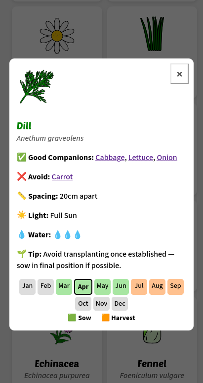
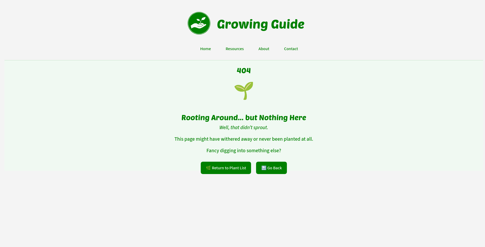
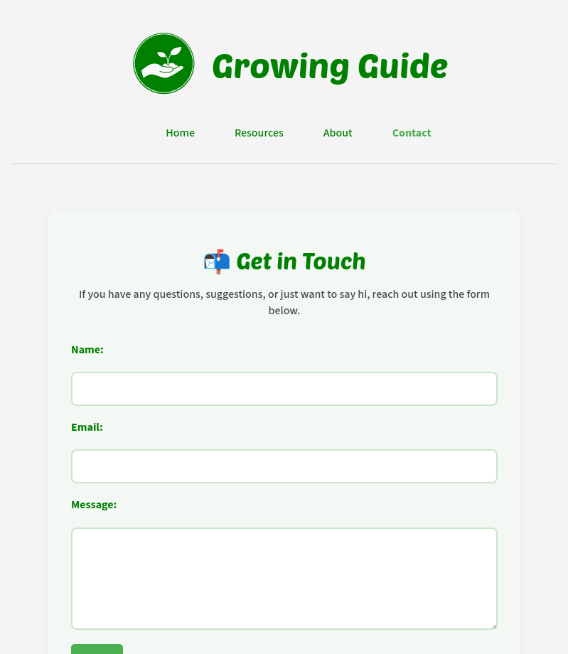

# Testing

> [!NOTE]
> Return back to the [README.md](README.md) file.

## Code Validation

### HTML

I have used the recommended [HTML W3C Validator](https://validator.w3.org) to validate all of my HTML files.

| Directory | File | URL | Screenshot | Notes |
| --- | --- | --- | --- | --- |
|  | [404.html](https://github.com/runwiththerhythm/growing-guide/blob/main/404.html) | [HTML Validator](https://validator.w3.org/nu/?doc=https://runwiththerhythm.github.io/growing-guide/404.html) |  |  |
|  | [index.html](https://github.com/runwiththerhythm/growing-guide/blob/main/index.html) | [HTML Validator](https://validator.w3.org/nu/?doc=https://runwiththerhythm.github.io/growing-guide/index.html) |  |  Fixed error |
|  | [resources.html](https://github.com/runwiththerhythm/growing-guide/blob/main/resources.html) | [HTML Validator](https://validator.w3.org/nu/?doc=https://runwiththerhythm.github.io/growing-guide/resources.html) |  |  |
|  | [about.html](https://github.com/runwiththerhythm/growing-guide/blob/main/about.html) | [HTML Validator](https://validator.w3.org/nu/?doc=https://runwiththerhythm.github.io/growing-guide/about.html) |  |  |
|  | [contact.html](https://github.com/runwiththerhythm/growing-guide/blob/main/contact.html) | [HTML Validator](https://validator.w3.org/nu/?doc=https://runwiththerhythm.github.io/growing-guide/contact.html) |  |  |

### CSS

I have used the recommended [CSS Jigsaw Validator](https://jigsaw.w3.org/css-validator) to validate my CSS file.

| Directory | File | URL | Screenshot | Notes |
| --- | --- | --- | --- | --- |
| assets | [style.css](https://github.com/runwiththerhythm/growing-guide/blob/main/assets/css/style.css) | [CSS Validator](https://jigsaw.w3.org/css-validator/validator?uri=https://runwiththerhythm.github.io/growing-guide) |  |


### JavaScript


I have used the recommended [JShint Validator](https://jshint.com) to validate all of my JS files.

| Directory | File | URL | Screenshot | Notes |
| --- | --- | --- | --- | --- |
| assets | [data.js](https://github.com/runwiththerhythm/growing-guide/blob/main/assets/js/data.js) | N/A |  | Notes (if applicable) |
| assets | [data.test.js](https://github.com/runwiththerhythm/growing-guide/blob/main/assets/js/data.test.js) | N/A |  | Notes (if applicable) |
| assets | [script.js](https://github.com/runwiththerhythm/growing-guide/blob/main/assets/js/script.js) | N/A |  | Notes (if applicable) |
| assets | [script.test.js](https://github.com/runwiththerhythm/growing-guide/blob/main/assets/js/script.test.js) | N/A |  | Notes (if applicable) |
|  | [jest.config.js](https://github.com/runwiththerhythm/growing-guide/blob/main/jest.config.js) | N/A |  | Notes (if applicable) |
|  | [jest.setup.js](https://github.com/runwiththerhythm/growing-guide/blob/main/jest.setup.js) | N/A |  | Notes (if applicable) |


## Responsiveness

I've tested my deployed project to check for responsiveness issues.

| Page | Mobile | Tablet | Desktop | Notes |
| --- | --- | --- | --- | --- |
| Home |  |  |  | Works as expected |
| Plant Modal |  |  |  | Works as expected |
| Month View |  |  |  | Works as expected |
| Resources |  |  |  | Works as expected |
| About |  |  |  | Works as expected |
| Contact |  |  |  | Works as expected |
| 404 |  |  |  | Works as expected |

## Browser Compatibility

I've tested my deployed project on multiple browsers to check for compatibility issues.

- [Chrome](https://www.google.com/chrome)
- [Firefox (Developer Edition)](https://www.mozilla.org/firefox/developer)
- [Brave](https://brave.com/download)

| Page | Chrome | Firefox | Brave | Notes |
| --- | --- | --- | --- | --- |
| Home |  |  |  | Works as expected |
| About |  |  |  | Works as expected |
| Contact|  |  |  | Works as expected |
| Modal |  |  |  | Works as expected |
| Month View |  |  |  | Works as expected |
| 404 |  |  |  | Works as expected |

## Lighthouse Audit

I've tested my deployed project using the Lighthouse Audit tool to check for any issues. 

| Mobile | Desktop |
| --- | --- |
|  |  |


## Defensive Programming

⚠️ INSTRUCTIONS ⚠️

Defensive programming (defensive design) is extremely important! When building projects that accept user inputs or forms, you should always test the level of security for each form field. Examples of this could include (but not limited to):

All Projects:

- Users cannot submit an empty form (add the `required` attribute)
- Users must enter valid field types (ensure the correct input `type=""` is used)
- Users cannot brute-force a URL to navigate to a restricted pages

Python Projects:

- Users cannot perform CRUD functionality if not authenticated (if login functionality exists)
- User-A should not be able to manipulate data belonging to User-B, or vice versa
- Non-Authenticated users should not be able to access pages that require authentication
- Standard users should not be able to access pages intended for superusers/admins

You'll want to test all functionality on your application, whether it's a standard form, or CRUD functionality, for data manipulation on a database. Try to access various pages on your site as different user types (User-A, User-B, guest user, admin, superuser). You should include any manual tests performed, and the expected results/outcome.

Testing should be replicable (can someone else replicate the same outcome?). Ideally, tests cases should focus on each individual section of every page on the website. Each test case should be specific, objective, and step-wise replicable.

Instead of adding a general overview saying that everything works fine, consider documenting tests on each element of the page (eg. button clicks, input box validation, navigation links, etc.) by testing them in their "happy flow", their "bad/exception flow", mentioning the expected and observed results, and drawing a parallel between them where applicable.

Consider using the following format for manual test cases:

- Expected Outcome / Test Performed / Result Received / Fixes Implemented

- **Expected**: "Feature is expected to do X when the user does Y."
- **Testing**: "Tested the feature by doing Y."
- (either) **Result**: "The feature behaved as expected, and it did Y."
- (or) **Result**: "The feature did not respond to A, B, or C."
- **Fix**: "I did Z to the code because something was missing."

Use the table below as a basic start, and expand on it using the logic above.

⚠️ --- END --- ⚠️

Defensive programming was manually tested with the below user acceptance testing:

| Page/Feature | Expectation | Test | Result | Screenshot |
| --- | --- | --- | --- | --- |
| Calculator UI | Feature is expected to allow the user to input two numbers and select an operator (`+`, `-`, `*`, `/`). | Entered two numbers and selected each operator to perform calculations. | Calculations for all operators worked as expected. |  |
| | Feature is expected to show an error message if inputs are empty (`NaN`). | Tried submitting calculations with empty input fields. | Error message displayed as expected. |  |
| | Feature is expected to display buttons that are clear, large, and easy to select on all devices. | Verified button sizes and usability across multiple devices (mobile, tablet, desktop). | Buttons were accessible and easy to use on all tested devices. |  |
| | Feature is expected to use high-contrast colors and accessible fonts. | Checked contrast ratios using accessibility tools (e.g., Lighthouse, Wave). | Colors and fonts met accessibility standards. |  |
| | Feature is expected to have clear labels and instructions for user guidance. | Reviewed labels and instructions for clarity and ease of use. | Labels and instructions were clear and intuitive. |  |
| Instant Calculation | Feature is expected to calculate and display results instantly after selecting an operator. | Selected operators after entering two numbers. | Results were displayed instantly. |  |
| Error Handling | Feature is expected to display correct results even if an equation was input incorrectly. | Entered various incorrect equations and verified the results. | Correct results were displayed for all tested cases. |  |
| Score Tracker | Feature is expected to track the number of correct and incorrect equations. | Performed multiple calculations (correct and incorrect) and checked the score tracker. | Score tracker updated correctly for all tested scenarios. |  |
| 404 Error Page | Feature is expected to display a 404 error page for non-existent pages. | Navigated to an invalid URL (e.g., `/test`) to test error handling. | A custom 404 error page was displayed as expected. |  |

## User Story Testing

⚠️ INSTRUCTIONS ⚠️

Testing User Stories is actually quite simple, once you've already got the stories defined on your README.

Most of your project's **Features** should already align with the **User Stories**, so this should be as simple as creating a table with the User Story, matching with the re-used screenshot from the respective Feature.

⚠️ --- END --- ⚠️

| Target | Expectation | Outcome | Screenshot |
| --- | --- | --- | --- |
| As a user | I would like to input two numbers and select an operator (`+`, `-`, `*`, `/`) | so that I can calculate a result. |  |
| As a user | I would like the application to show me an error message if I enter empty input (`NaN`) | so that I understand what went wrong. |  |
| As a user | I would like the calculation to happen instantly after I select an operator | so that I get my result quickly without waiting. |  |
| As a user | I would like the application to have clear and large buttons for each operator | so that I can easily select the correct one on any device. |  |
| As a user | I would like the application to have high-contrast colors and accessible fonts | so that I can easily read and interact with it. |  |
| As a user | I would like clear labels and instructions | so that I understand how to use the app without confusion. |  |
| As a user | I would like the app to show me the correct result if my equation was incorrect | so that I understand how the answer was calculated. |  |
| As a user | I would like to see how many equations I get correct or incorrect | so I can push myself to improve my math skills. |  |
| As a user | I would like to see a 404 error page if I get lost | so that it's obvious that I've stumbled upon a page that doesn't exist. |  |

## Automated Testing

I have conducted a series of automated tests on my application.

> [!NOTE]
> I fully acknowledge and understand that, in a real-world scenario, an extensive set of additional tests would be more comprehensive.

### JavaScript (Jest Testing)

⚠️ INSTRUCTIONS ⚠️

Adjust the code below (file names, function names, etc.) to match your own project files/folders. Use these notes loosely when documenting your own Jest procedures, and remove/adjust where applicable.

⚠️ SAMPLE ⚠️

I have used the [Jest](https://jestjs.io) JavaScript testing framework to test the application functionality. In order to work with Jest, I first had to initialize NPM.

- `npm init`
- Hit `<enter>` for all options, except for **test command:**, just type `jest`.

Add Jest to a list called **Dev Dependencies** in a dev environment:

- `npm install --save-dev jest`

**IMPORTANT**: Initial configurations

When creating test files, the name of the file needs to be `file-name.test.js` in order for Jest to properly work. Without the following, Jest won't properly run the tests:

- `npm install -D jest-environment-jsdom`

Due to a change in Jest's default configuration, you'll need to add the following code to the top of the `.test.js` file:

```js
/**
 * @jest-environment jsdom
 */

const { test, expect } = require("@jest/globals");
const { function1, function2, function3, etc. } = require("../script-name");

beforeAll(() => {
    let fs = require("fs");
    let fileContents = fs.readFileSync("index.html", "utf-8");
    document.open();
    document.write(fileContents);
    document.close();
});
```

Remember to adjust the `fs.readFileSync()` to the specific file you'd like you test. The example above is testing the `index.html` file.

Finally, at the bottom of the script file where your primary scripts are written, include the following at the very bottom of the file. Make sure to include the name of all of your functions that are being tested in the `.test.js` file.

```js
if (typeof module !== "undefined") module.exports = {
    function1, function2, function3, etc.
};
```

Now that these steps have been undertaken, further tests can be written, and be expected to fail initially. Write JS code that can get the tests to pass as part of the Red-Green refactor process. Once ready, to run the tests, use this command:

- `npm test`

**NOTE**: To obtain a coverage report, use the following command:

- `npm test --coverage`

Below are the results from the tests that I've written for this application:

| Test Suites | Tests | Screenshot |
| --- | --- | --- |
| 1 passed | 16 passed |  |

#### Jest Test Issues

⚠️ INSTRUCTIONS ⚠️

Use this section to list any known issues you ran into while writing your Jest tests. Remember to include screenshots (where possible), and a solution to the issue (if known). This can be used for both "fixed" and "unresolved" issues. Remove this sub-section entirely if you somehow didn't run into any issues while working with Jest.

⚠️ --- END --- ⚠️

## Bugs

⚠️ INSTRUCTIONS ⚠️

Nobody likes bugs,... except the assessors! Projects seem more suspicious if a student doesn't properly track their bugs. If you're about to submit your project without any bugs listed below, you should ask yourself why you're doing this course in the first place, if you're able to build this entire application without running into any bugs. The best thing you can do for any project is to document your bugs! Not only does it show the true stages of development, but think of it as breadcrumbs for yourself in the future, should you encounter the same/similar bug again, it acts as a gentle reminder on what you did to fix the bug.

If/when you encounter bugs during the development stages of your project, you should document them here, ideally with a screenshot explaining what the issue was, and what you did to fix the bug.

Alternatively, an improved way to manage bugs is to use the built-in **[Issues](https://www.github.com/runwiththerhythm/growing-guide/issues)** tracker on your GitHub repository. This can be found at the top of your repository, the tab called "Issues".

If using the Issues tracker for bug management, you can simplify the documentation process for testing. Issues allow you to directly paste screenshots into the issue page without having to first save the screenshot locally. You can add labels to your issues (e.g. `bug`), assign yourself as the owner, and add comments/updates as you progress with fixing the issue(s). Once you've solved the issue/bug, you should then "Close" it.

When showcasing your bug tracking for assessment, you can use the following examples below.

⚠️ --- END --- ⚠️

### Fixed Bugs

[](https://www.github.com/runwiththerhythm/growing-guide/issues?q=is%3Aissue+is%3Aclosed+label%3Abug)

I've used [GitHub Issues](https://www.github.com/runwiththerhythm/growing-guide/issues) to track and manage bugs and issues during the development stages of my project.

All previously closed/fixed bugs can be tracked [here](https://www.github.com/runwiththerhythm/growing-guide/issues?q=is%3Aissue+is%3Aclosed+label%3Abug).


### Unfixed Bugs

⚠️ INSTRUCTIONS ⚠️

You will need to mention any unfixed bugs and why they are not fixed upon submission of your project. This section should include shortcomings of the frameworks or technologies used. Although time can be a big variable to consider, paucity of time and difficulty understanding implementation is not a valid reason to leave bugs unfixed. Where possible, you must fix all outstanding bugs, unless outside of your control.

If you've identified any unfixed bugs, no matter how small, be sure to list them here! It's better to be honest and list them, because if it's not documented and an assessor finds the issue, they need to know whether or not you're aware of them as well, and why you've not corrected/fixed them.

⚠️ --- END --- ⚠️

[](https://www.github.com/runwiththerhythm/growing-guide/issues)

Any remaining open issues can be tracked [here](https://www.github.com/runwiththerhythm/growing-guide/issues).


### Known Issues

| Issue | Screenshot |
| --- | --- |
| On devices smaller than 375px, the page starts to have horizontal `overflow-x` scrolling. |  |
| When validating HTML with a semantic `<section>` element, the validator warns about lacking a header `h2-h6`. This is acceptable. |  |

> [!IMPORTANT]
> There are no remaining bugs that I am aware of, though, even after thorough testing, I cannot rule out the possibility.

